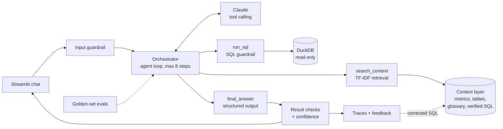

# Analytics Agent: text-to-SQL on Claude

Ask business questions in plain English and get back a trusted answer: the number, a chart,
the SQL that produced it, the definitions it used and a confidence level. Built for a fictional
test-prep company, **BrightPath Learning** (JEE, NEET and Foundation courses, online classes and
offline centres). All data is synthetic.

The design follows one principle: **the model only writes and explains; everything that must
be correct is enforced in code.** Metric formulas come from a context layer, permissions are
enforced by a SQL parser and a read-only database, and quality is measured by evals.

## Architecture



## What each part does

| Technique | How it is implemented | File |
| --- | --- | --- |
| Tool calling | Claude chooses between `search_context`, `run_sql` and `final_answer`; the orchestrator runs them | `tools.py`, `agent.py` |
| Agent loop (ReAct) | Reason, call a tool, read the result, repeat; capped at 8 steps and 3 failed queries | `agent.py` |
| Context layer | Certified metric definitions, table and column docs, glossary, business rules, verified queries | `context.yaml` |
| Retrieval (RAG) | TF-IDF + cosine similarity over the context layer, plus linked table docs (schema linking) | `retriever.py` |
| Prompting | System prompt with rules, business rules, today's date and data window | `agent.py` |
| Structured output | `final_answer` tool returns type, summary, SQL, assumptions and chart type | `tools.py` |
| Self-correction | Database errors are returned to the model, which repairs its query | `agent.py` |
| Clarification | Vague questions get one clarifying question with concrete options | `agent.py` |
| Input guardrail | Blocks prompt-injection patterns and requests to change data before any model call | `guardrails.py` |
| SQL guardrail | Parses every query (sqlglot): SELECT only, approved tables, no personal-data columns, no table functions | `guardrails.py` |
| Engine guardrail | DuckDB opened read-only with external file and network access disabled | `tools.py` |
| Result checks | Empty results, impossible rates, duplicate rows from bad joins | `guardrails.py` |
| Confidence | Computed from facts (certified metric matched, SQL fixes needed, result warnings), not asked of the model | `agent.py` |
| Memory | Last three turns passed back so follow-up questions work | `agent.py` |
| Prompt caching | Top-level cache control so repeated loop calls reuse the cached prefix | `agent.py` |
| Observability | Every run traced: steps, tokens, cost, latency | `logger.py` |
| Feedback loop | Thumbs-down plus corrected SQL becomes a verified query the retriever finds next time | `app.py`, `logger.py` |
| Evals | 22-case golden set: execution accuracy, clarification and refusal accuracy, LLM-as-judge faithfulness | `run_eval.py`, `eval/golden.yaml` |
| Tests | Guardrails, retrieval, comparison logic, agent loop and eval harness, run with a simulated model | `tests/` |

## Run it

**Colab (guided):** open `walkthrough.ipynb` in Google Colab and follow it step by step.

**Locally:**
```bash
pip install -r requirements.txt
export ANTHROPIC_API_KEY=sk-ant-...
python data_setup.py          # builds data/edtech.duckdb (also happens automatically)
streamlit run app.py
python run_eval.py --judge    # full eval, roughly USD 1
python -m tests.test_all      # no API key needed
```

## Deploy (Streamlit Community Cloud)

1. Push this repository to GitHub.
2. At share.streamlit.io choose **Create app**, pick the repository, branch `main`, file `app.py`.
3. Under **Advanced settings** paste the secrets from `secrets.toml.example` with real values.
4. Deploy. Set a monthly spend limit in the Anthropic Console, and keep `APP_PASSWORD` set,
   because anyone who can open the app spends your API credit.

## Evaluation

Answers are scored on **execution accuracy**: the agent's query and the analyst's gold query
are both run, and their results compared, not their SQL text. The comparison ignores column
names and row order, accepts rates as 0-1 or 0-100, and accepts the same numbers in a different
layout. Vague questions must produce a clarifying question; personal-data, off-topic and
injection requests must be refused. `--judge` adds an LLM judge that checks every number in the
summary is supported by the result. Results appear on the app's **Evals** page.

## Design decisions and trade-offs

- **TF-IDF instead of embeddings.** The context layer has about 40 documents, where keyword
  retrieval is fast, free and deterministic. Synonyms are written into the metric entries.
  At larger scale: embeddings + keyword (hybrid) search + a reranker, behind the same `search()`.
- **Certified metrics over free SQL.** The prompt tells the model to follow metric definitions
  exactly. A production version would compile metrics through a semantic layer (for example the
  dbt Semantic Layer) so the model never writes the formula at all.
- **DuckDB instead of a cloud warehouse.** No server, no cost, runs inside the app. Swapping to
  BigQuery means changing `execute_sql()` and using BigQuery's own row-level security, column
  masking and maximum-bytes-billed limit.
- **Guardrails in code, not in the prompt.** The prompt asks the model to avoid personal data;
  the SQL parser and the read-only connection make sure of it.
- **A controlled loop.** Step and retry limits keep cost and latency bounded.

## Limitations and next steps

- Logs reset when the Streamlit app restarts; production would write traces and feedback to a database.
- Row-level security by user role is not modelled; the warehouse would enforce it.
- Token streaming of the final answer, and a semantic-layer compiler for certified metrics.
- Larger golden set built from real request logs, rerun automatically on every change.
